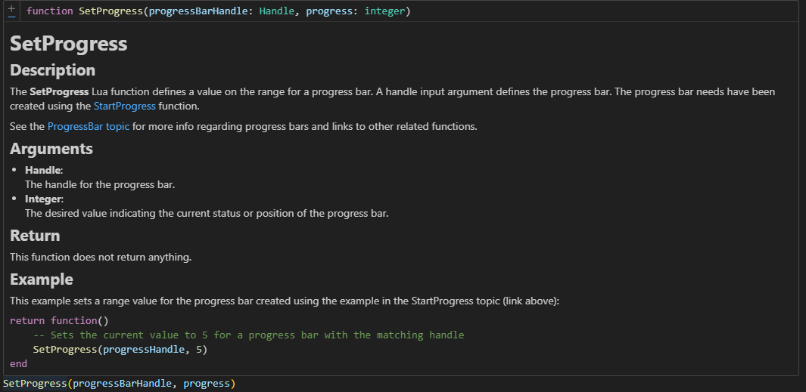

# Ma3 Lua API
A VS Code extension for the Grand Ma 3 Lua Api, it provide autocomplete and documentation for functions to write Grand Ma 3 plugins.

### Suggestions:

When typing the extension provide functions related to the selected API version.

### Autocomplete:

When you select a suggested function, the extension add automatically functions parameters.

### Documentation:

The extension provide documentation and examples with a mouse over popup.

### API version selection:

The VS Code bottom toolbar display the actual Ma3 API version.
You can change it by click on id and select the version you need:

# How to contribute
This is an open source project, feel free to contribute by making pull requests.

### What do you need:

 - [VS Code IDE](https://code.visualstudio.com/download)
 - [Node JS](https://nodejs.org/en/download)
 - Clone this repository 

### File organization
All the extension data is in the resources folder, that folder contain a folder for each Ma3 version, each folder contain:

- [ma3_dummy_api.lua](resources/2.1/ma3_documented_api.lua) : to helps the Lua Language Server to know all the functions 
- [ma3_object_api.json](resources/2.1/ma3_object_api.json) : contain all object api documentation and autocompletion
- [ma3_object_free_api.json](resources/2.1/ma3_object_free_api.json) : contain all object free api documentation and autocompletion

### To update or complete the API documentation:

This image explain how to fill the json files according to the [Ma help pages](https://help.malighting.com/grandMA3/2.1/HTML/lua_objectfree.html) that corresponding to the version.

- For the body part, fill the parentheses with the function parameters like:

    function(${1:fixtureId}, ${2:count}, ${3:type})

- All the text part need to be converted to Markdown format, this can be done using this online tool: [Clipboard 2 Markdown](https://euangoddard.github.io/clipboard2markdown/).

- After that you have to convert the markdown text to a single line string, this can be done with [json Stringlfy](https://toolsaday.com/text-tools/json-stringify).

- For the code part of the example, you only have to convert to a single line string.

### To update or complete the dummy file:

This file contain dummy functions with input parameters, you have to enumerate all parameters types, if they are optional, if they can be nil and the return type:

    ---@param fixtureTableHandle Handle
    ---@param multiPatchAmount integer
    ---@param undoText? string @Optional
    ---@return integer|nil multiPatchAmountCreated
    function CreateMultiPatch(fixtureTableHandle, multiPatchAmount, undoText)
        return 0
    end 

Test your modification and then, start a pull request!
